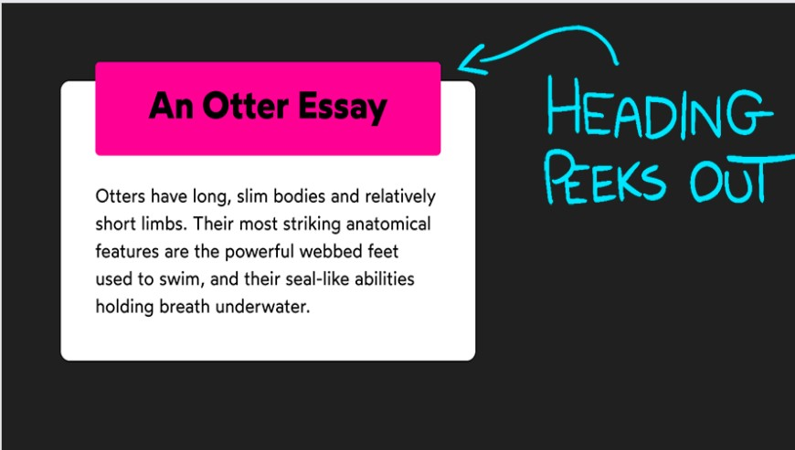
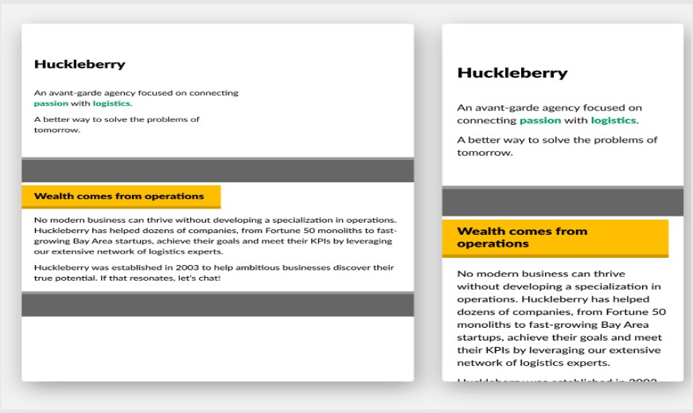
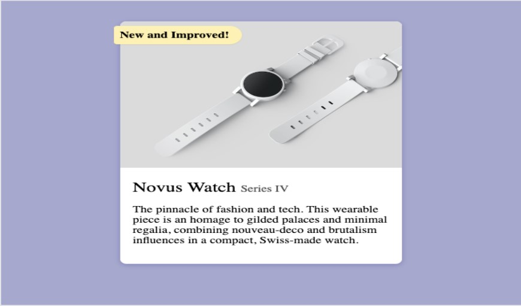
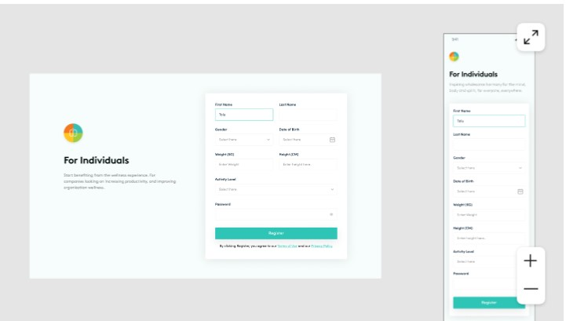

# CSS Assignment Project (Part. 1)

## Overview
This project involves converting four design mockups into responsive HTML and CSS implementations. Each design represents different UI components and requires careful attention to detail in preserving the visual aesthetics and functionality.

## Project Requirements

### 1. Otter Essay Card

**Requirements:**
- Convert the otter essay card design into HTML/CSS
- Implement proper typography hierarchy
- Match the styling:
  - Hot pink header background
  - Clean white card design
  - Proper text spacing and margins

### 2. Huckleberry

**Requirements:**
- Convert the Huckleberry agency section into HTML/CSS
- Implement proper content structure
- Match the styling:
  - Yellow highlight section
  - Two-tone text colors
  - Proper spacing and alignment
  - Typography hierarchy

### 3. Novus Watch

**Requirements:**
- Convert the Novus Watch product card into HTML/CSS
- Implement proper image placement
- Match the styling:
  - Yellow accent badge
  - Gray background
  - Product image layout
  - Typography matching the design

### 4. Web Development Training

**Requirements:**
- Convert the wellness platform registration form design into HTML/CSS
- Implement form validation
- Include responsive design for various screen sizes
- Match the color scheme and styling:
  - Brand logo with gradient colors
  - Teal accent color for buttons
  - Clean, minimal form layout

## Technical Specifications

### General Requirements
- Use semantic HTML5 elements
- Implement responsive design principles
- Ensure cross-browser compatibility
- Follow accessibility best practices
- Use clean, well-organized CSS
- Implement proper spacing and alignment

### Recommended Tools
- HTML5
- CSS3
- Modern CSS features (Flexbox/Grid)
- Media queries for responsiveness
- CSS custom properties for theming

## Contributing

This is an individual assignment project. No contributions are expected.

## License

This project is created for assessment purpose as part of the AltSchool Africa School of Engineering curriculum.

